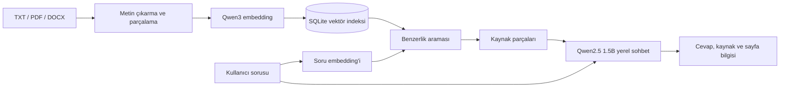
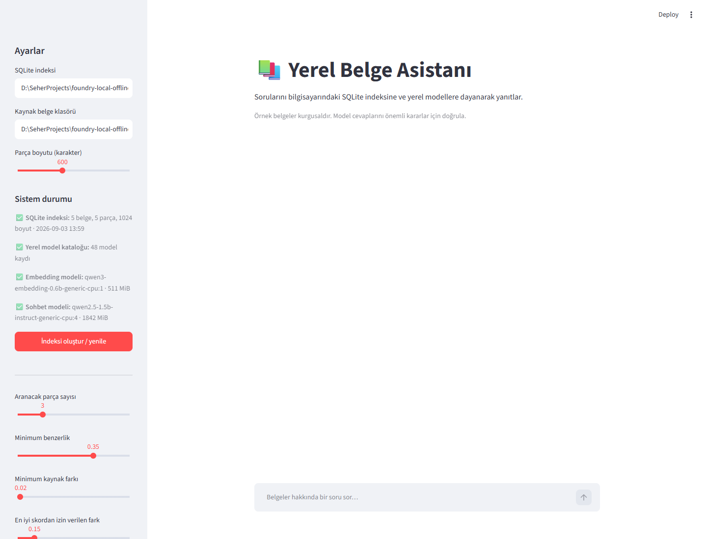

# Foundry Local Offline Assistant

Bu projenin amacı, bilgisayardaki belgeler hakkında soruları yanıtlayan yerel bir
yapay zekâ asistanı geliştirmektir. Microsoft Foundry Local ile model çalıştırma,
RAG (Retrieval-Augmented Generation) ile ilgili belge parçalarını bulma ve SQLite
ile verileri yerel olarak saklama yaklaşımı kullanılacaktır.

Hedef, gerekli modeller ve bağımlılıklar ilk kez indirildikten sonra uygulamanın
internet bağlantısı olmadan çalışabilmesidir. Yerel model ve indeks hazırlığı
sonrasında ağ erişimi olmayan bir proxy ile uçtan uca akış doğrulandı.

## Hızlı başlangıç

Windows PowerShell'de proje kökünden aşağıdaki sırayı izle:

```powershell
python -m venv .venv
.\.venv\Scripts\python.exe -m pip install -r requirements.txt
Copy-Item .env.example .env
.\.venv\Scripts\python.exe -X utf8 scripts\hello_model.py --download
.\.venv\Scripts\python.exe -X utf8 scripts\embedding_demo.py --download
.\.venv\Scripts\python.exe -X utf8 scripts\health_check.py
.\.venv\Scripts\python.exe -X utf8 scripts\ingest_documents.py --save
.\.venv\Scripts\python.exe -X utf8 -m streamlit run app.py
```

İlk iki model komutu internet bağlantısı ve yaklaşık 2,4 GB boş alan ister.
Sonraki çalıştırmalarda modeller önbellekten kullanılır. Uygulama varsayılan olarak
`http://localhost:8501` adresinde açılır.

## Mimari



Tüm çıkarım yerel Foundry Local modelleriyle yapılır. PDF sayfası ve belge türü
parça meta verisinde korunur; düşük güvenli aramalar güvenli geri dönüş üretir.

## Demo



Sunum sırasında şu dört senaryo kullanılabilir:

1. **Cevaplanabilir:** “Bilgisayar laboratuvarı hafta içi hangi saatlerde açıktır?”
2. **Kaynak gösterimi:** DOCX kaynak adını ve ilgili metin parçasını aç.
3. **Yanıtsız:** “Kampüs servis otobüsünün güzergâhı nedir?” sorusunda güvenli geri dönüşü göster.
4. **Çevrimdışı:** `health_check.py` çıktısını doğrula, ağı kapat ve aynı soruyu yeniden çalıştır.

Final sunumu: [docs/Foundry_Local_Final_Sunum.pptx](docs/Foundry_Local_Final_Sunum.pptx)

Türkçe seslendirmeli demo:
[docs/demo/foundry-local-offline-demo-tr.mp4](docs/demo/foundry-local-offline-demo-tr.mp4)
([anlatım metni](docs/demo/demo-metni.md))

## Mevcut durum

- Proje klasör yapısı oluşturuldu.
- Python 3.12 sanal ortamı ve `requirements.txt` bağımlılıkları hazırlandı.
- Git dışlama kuralları eklendi.
- Model listeleme betiği hazırlandı; katalog ve model önbelleği durumunu gösterir.
- Streamlit kullanıcı arayüzü ve 30 vakalık tekrarlanabilir değerlendirme akışı hazırdır.
- TXT, metin tabanlı PDF ve DOCX okuma ile kaynak bilgili parçalama hazırdır.
- Belge parçalarının embedding'leri SQLite'a kaydediliyor; tekrar kayıtta kopya oluşmuyor.
- Soru embedding'i ile SQLite'taki en ilgili parçaları bulan arama komutu hazırlandı.
- Yerel RAG komutu ilgili parçalarla kaynaklı cevap üretiyor; düşük skorda güvenli geri dönüş yapıyor.
- Tek soruluk yerel model denemesi `scripts/hello_model.py` ile yapılabilir.
- `qwen2.5-0.5b` CPU modeli indirildi ve ilk yerel Türkçe cevap başarıyla alındı.
- Üç örnek cümle üzerinde embedding ve benzerlik sıralama betiği hazırlandı.
- `qwen3-embedding-0.6b` indirildi; üç Türkçe soruda ilgili cümle ilk sırada bulundu.
- Uçtan uca RAG akışı hem komut satırında hem Streamlit arayüzünde çalışıyor.

## Planlanan çalışma akışı

1. Belgeleri oku ve metin parçalarına ayır.
2. Parçaların embedding vektörlerini oluştur ve SQLite'a kaydet.
3. Kullanıcının sorusunu aynı embedding modeliyle vektöre dönüştür.
4. Benzerlik aramasıyla ilgili parçaları bul.
5. Soruyu ve bulunan parçaları yerel sohbet modeline ilet.
6. Cevabı kaynak bilgileriyle kullanıcıya göster.

## Klasör yapısı

```text
app.py                       # Streamlit sohbet arayüzü
requirements.txt             # Sabitlenmiş Python bağımlılıkları
.env.example                 # Paylaşılabilir yerel yapılandırma şablonu
src/offline_assistant/       # Uygulama modülleri
scripts/list_models.py       # Katalog ve indirilen modelleri listeler
scripts/hello_model.py       # Yerel sohbet modeline tek soru gönderir
scripts/embedding_demo.py    # Üç cümleyi soruya benzerliğine göre sıralar
scripts/ingest_documents.py  # TXT/PDF/DOCX önizleme, embedding ve SQLite kaydı
scripts/search_documents.py  # SQLite indeksinde semantik arama yapar
scripts/answer_documents.py  # Yerel modelle kaynaklı RAG cevabı üretir
scripts/evaluate.py          # Retrieval ve isteğe bağlı cevap kalitesi değerlendirmesi
scripts/health_check.py      # Ağ kullanmadan indeks ve model dosyalarını denetler
data/raw/                   # Yerel kaynak belgeler
data/database/              # Üretilecek SQLite veritabanları
data/foundry/               # SDK çalışma dosyaları ve model önbelleği (Git dışında)
tests/                      # Testler
evaluation/                 # Değerlendirme soruları ve sonuçları
docs/screenshots/           # Dokümantasyon ekran görüntüleri
```

Git boş klasörleri takip etmez. Yeni bir kopyada veri klasörleri gerektiğinde
oluşturulmalıdır.

## Mevcut ortamı kontrol etme

Proje kök dizinindeki PowerShell terminalinde:

```powershell
.\.venv\Scripts\python.exe --version
.\.venv\Scripts\python.exe -m pip check
git status --short
```

Bu komutlar mevcut sanal ortamı doğrudan kullanır; ortamı etkinleştirmek gerekmez.
`pip check` paket bağımlılıklarını kontrol eder, modelin çalıştığını doğrulamaz.
Uygulamayı başlatma ve ilk model hazırlığı adımları **Hızlı başlangıç** bölümünde
verilmiştir.

## Git ve yerel dosyalar

Sanal ortam, `.env` ayarları, Python/test önbellekleri, günlükler ve
`data/database/` içindeki SQLite dosyaları Git dışında tutulur.
`.env.example` paylaşılabilir ayar şablonu olarak takip edilir; gerçek sırlar
bu dosyaya yazılmamalıdır.

## Yapılandırma

Uygulamanın ortak varsayılanları `src/offline_assistant/config.py` içindedir.
Yerel ayarları değiştirmek için `.env.example` dosyasını `.env` adıyla kopyalayıp
değerleri düzenle. `.env` Git'e eklenmez; `.env.example` yalnız güvenli örnek
değerler içerir.

Desteklenen ayarlar kaynak/SQLite/Foundry/model önbelleği yolları, sohbet ve
embedding model alias'ları, `top_k`, minimum skor, kaynak farkı, göreli skor
farkı, parça boyutu ve cevap token sınırıdır. Göreli yollar proje köküne göre
çözülür. Komut satırında açıkça verilen seçenekler `.env` değerlerinin önüne
geçer. Geçersiz sayı aralıkları ve boş model adları başlangıçta reddedilir.

`data/raw/` otomatik olarak dışlanmaz. Özel veya kişisel belgeleri depoya
eklemeden önce kontrol et.

## Modelleri listeleme

Proje kök dizininde:

```powershell
.\.venv\Scripts\python.exe -X utf8 scripts\list_models.py
```

Betik SDK'yı başlatır, katalogdaki model alias'larını, seçili varyantlarını,
yeteneklerini ve bu varyantların indirilmiş olup olmadığını gösterir.
Son bölümde önbellekteki tüm indirilen varyantları listeler.
Model indirmez, belleğe yüklemez veya cevap üretmez. Kataloğun ilk kez alınması
ya da yenilenmesi internet gerektirebilir.

`-X utf8`, Türkçe terminal çıktısının UTF-8 olarak üretilmesini sağlar.

Varsayılan model önbelleği `data/foundry/cache/models/` klasörüdür. Bu uygulamaya
ait SDK çalışma dosyaları `data/foundry/` altında tutulur ve Git'e eklenmez.
Başka bir uygulamada indirdiğin modeller otomatik olarak bu klasöre taşınmaz.
Mevcut model önbelleğini okumak için `--model-cache-dir` seçeneğine o klasörün
yolunu verebilirsin. Gösterilen indirme durumu yalnızca seçilen önbellek içindir.

## Yerel sağlık ve çevrimdışı çalışma

İnternet bağlantısı kullanmadan SQLite indeksini, indeksin tam embedding modelini
ve varsayılan sohbet modelinin dosyalarını kontrol et:

```powershell
.\.venv\Scripts\python.exe -X utf8 scripts\health_check.py
```

Komut her bileşeni `[OK]` veya `[HATA]` ile, indeks boyutlarını ve yerel model
dosyalarının toplam boyutunu gösterir. `--db`, `--model-cache-dir` ve
`--chat-model` seçenekleri vardır. SDK'yı başlatmadığı ve ağ kullanmadığı için
model dosyalarının çalıştırılabilirliğini tek başına garanti etmez.

3 Eylül 2026'da yeni bir süreçte HTTP/HTTPS çıkışı erişilemeyen yerel proxy'ye
yönlendirilerek uçtan uca kontrol yapıldı. SDK yerel katalogdan başladı, sorgu
embedding'i üretildi, beş parçalık indeks arandı ve `qwen2.5-1.5b` doğru DOCX
kaynağıyla cevap verdi. Bu kontrol Windows ağ bağdaştırıcısını fiziksel olarak
kapatmaz. Teslim öncesindeki son manuel doğrulama şöyledir:

1. `health_check.py` çıktısındaki bütün bileşenlerin `[OK]` olduğunu doğrula.
2. Wi-Fi/Ethernet bağlantısını kapat.
3. Yeni PowerShell sürecinde Streamlit uygulamasını başlat.
4. Cevaplanabilir ve kapsam dışı birer soru sor.
5. Uygulamayı kapatıp yeniden başlatarak testi tekrarla.

SDK 1.2.4 yapılandırmasında ayrı bir çevrimdışı anahtar bulunmadığı için başlangıç
yerel katalog önbelleğine dayanır. İlk hazırlık ve eksik model indirme işlemleri
internet gerektirir.

## Sıradaki hedef

Fiziksel ağ bağlantısını kapatarak son canlı demoyu yapmak ve sunum akışını
prova etmek. GitHub yayını ve temiz klasörde kurulum testi tamamlandı.

## RAG değerlendirmesi

`evaluation/questions.json`; 18 cevaplanabilir, 9 yanıtsız veya belirsiz ve 3
boş/geçersiz giriş vakası içerir. Üç cevaplanabilir soru birden fazla bilginin
birleştirilmesini gerektirir. Her kayıt soru türünü ve örnek cevabı; cevaplanabilir
kayıtlar ayrıca beklenen kaynak ile cevap terimlerini belirtir. Veri kümesi Git'te
tutulur; zaman damgalı JSON ve CSV raporları `evaluation/results/` altında üretilir
ve Git'e eklenmez.

Yalnız retrieval, eşik ve kapsam dışı soru davranışını ölçmek için:

```powershell
.\.venv\Scripts\python.exe -X utf8 scripts\evaluate.py
```

Yerel sohbet cevaplarını, beklenen terimleri ve kaynak etiketi kullanımını da
ölçmek için:

```powershell
.\.venv\Scripts\python.exe -X utf8 scripts\evaluate.py --with-generation
```

`--cases`, `--db`, `--output-dir`, `--top-k`, `--min-score`,
`--min-source-margin`, `--max-score-drop`, `--chat-model` ve `--max-tokens`
seçenekleri kullanılabilir.
Betik indeksin oluşturulduğu tam embedding modelini kullanır; modelleri otomatik
indirmez. Ölçüm setinde hem cevaplanabilir hem yanıtsız soru olması gerekir.

2 Eylül 2026 başlangıç ölçümünde doğru kaynak 12 sorunun tamamında ilk sırada
bulundu (`hit@1`, `hit@3` ve MRR: 1,00), ancak 6 kapsam dışı sorunun biri yanlış
kabul edildi. 3 Eylül'de en iyi sonuç ile farklı bir kaynaktaki en iyi sonuç
arasına bir güven farkı eklendi. Beş belgeli koleksiyon ölçümünden sonra varsayılan
fark 0,02 olarak ayarlandı. İlk iyileştirmede 12 cevaplanabilir
sorunun tamamı kabul edildi, 6 kapsam dışı sorunun tamamı reddedildi ve
yönlendirme doğruluğu %100 oldu. Küme 27 vakaya genişletildikten sonra 15/15
cevaplanabilir soru kabul edildi, 9/9 yanıtsız veya belirsiz soru ile 3/3 geçersiz
giriş reddedildi. Beş belge ve 30 vakalık son kümede doğru kaynak bütün
cevaplanabilir sorularda ilk üç sonuç içindedir. Bu sonuç yalnız güvenli örnek
veri kümesine aittir.

| Ölçüm | Sonuç |
| --- | ---: |
| Hit@1 | %94,44 |
| Hit@3 | %100 |
| MRR | %97,22 |
| Cevaplanabilir kabul | %100 |
| Yanıtsız/belirsiz ret | %100 |
| Yönlendirme doğruluğu | %100 |
| Geçersiz giriş ret | %100 |

`qwen2.5-0.5b` ile en iyi tam akış denemesinde cevapların ortalama beklenen terim
kapsaması %41,67 oldu. `qwen2.5-1.5b` ile 27 vakalık karşılaştırmada 15
cevaplanabilir sorunun ortalama terim kapsaması %97,78'e çıktı; bu nedenle 1.5B
model varsayılan yapıldı. Katalog boyutu 1822 MB'dır ve CPU üzerinde daha yavaştır.
Her iki model de RAG koşusunda istenen kaynak etiketini atlayabildi. Eksik etiket
artık uygulama tarafından doğrulanmış ilk retrieval kaynağından eklenir ve raporda
`model_citation_rate` ile `citation_repair_rate` ayrı gösterilir. Bu sonuç retrieval
katmanının örnek sette güçlü olduğunu ve model boyutunun cevap kalitesini belirgin
biçimde etkilediğini gösterir. Terim kapsaması basit
metin eşleştirme ölçüsüdür; anlamsal doğruluğun insan değerlendirmesinin yerini
tutmaz. Aynı makinedeki retrieval süresi ortalama 1,26 saniye, p95 1,88 saniyeydi;
model/katalog ilk açılışı bu sürelere dahil değildir.

## Öğrenme günlüğü

Aşağıdaki bölümler, projenin ilk model denemesinden kullanıcı arayüzüne kadar
nasıl geliştirildiğini ve her aşamada neyin doğrulandığını kaydeder.

### İlk yerel model cevabı

İlk denemede küçük `qwen2.5-0.5b` sohbet modeli kullanılır. Proje kökünde:

```powershell
.\.venv\Scripts\python.exe -X utf8 scripts\hello_model.py --download
```

`--download`, yalnızca model önbellekte yoksa indirmeye izin verir. İlk indirme
internet bağlantısı ve diskte boş alan gerektirir. Model boyutu katalogdan okunup
indirme öncesinde gösterilir. Model yerelde mevcutsa tekrar indirilmez.

Sonraki denemelerde kendi sorunu verebilirsin:

```powershell
.\.venv\Scripts\python.exe -X utf8 scripts\hello_model.py --prompt "2 + 2 kaç eder?"
```

Betik sırasıyla SDK'yı başlatır, modeli bulur, gerekirse indirir, belleğe yükler,
tek bir sorunun cevabını üretir ve modeli bellekten çıkarır. İndirilen dosyalar
model listeleme betiğiyle aynı `data/foundry/cache/models/` klasöründe kalır.
Yükleme ve cevap üretme süreleri ayrı gösterilir; indirme süresi bu ölçümlere
dahil değildir. Sohbet geçmişi tutulmaz ve henüz belgeler kullanılmaz.

`--model` ile başka bir katalog alias'ı, `--max-tokens` ile cevap uzunluğu sınırı,
`--model-cache-dir` ile farklı bir model önbelleği seçilebilir. Varsayılan cevap
sınırı 128 tokendır. Bu küçük modelin cevap kalitesi sınırlı olabilir; ilk hedef
yerel çıkarımın çalıştığını doğrulamaktır.

`--download` kullanmamak tam çevrimdışı mod anlamına gelmez: SDK'nın katalog
sorgusu yine internet gerektirebilir. Tam çevrimdışı başlangıç ayrıca test edilecektir.

### Doğrulanan ilk deneme (30 Ağustos 2026)

- Varyant: `qwen2.5-0.5b-instruct-generic-cpu:4`.
- Katalog boyutu: 822 MB.
- Soru: “Merhaba! Kendini Türkçe tek cümleyle tanıtır mısın?”
- Cevap: “Merhaba! Size nasıl yardımcı olabilirim?”
- Yükleme: 2,73 saniye; cevap üretme: 0,97 saniye.
- İşlem başarıyla tamamlandı ve model bellekten çıkarıldı.
- İkinci çalıştırmada `--download` verilmeden önbellek kullanıldı; “2 + 2 kaç eder?
  Sadece sonucu yaz.” sorusuna “4” cevabı alındı (yükleme 2,33 saniye, cevap 0,34 saniye).

Bu iki deneme yerel çıkarımın çalıştığını gösterir; Türkçe kalite, talimata uyum
veya genel performans garantisi değildir. Süreler donanıma ve soruya göre değişir.
SDK/katalog başlangıcı bu sürelerin dışındadır; kısıtlı ağda yeniden başlatma
denemesinde katalog beklemesi gözlendi. Tüm bilgisayarın interneti kapatılarak
uçtan uca çevrimdışı çalışma testi henüz yapılmadı.

### Embedding ve benzerlik denemesi

`scripts/embedding_demo.py`, kütüphane saatleri, yemekhane ve ders kaydı hakkında
üç sabit Türkçe cümle kullanır. Cümleleri ve soruyu aynı yerel
`qwen3-embedding-0.6b` modeliyle sayısal vektörlere dönüştürür; kosinüs
benzerliğini hesaplayıp üç cümleyi yüksek skordan düşük skora sıralar.
Bu model sohbet modelinden ayrıdır ve ilk kullanımda ayrıca indirilir.

```powershell
.\.venv\Scripts\python.exe -X utf8 scripts\embedding_demo.py --download
```

Varsayılan soru “Kütüphane saat kaçta kapanıyor?” şeklindedir. Sonraki denemelerde
indirme seçeneği vermeden kendi sorunu sorabilirsin:

```powershell
.\.venv\Scripts\python.exe -X utf8 scripts\embedding_demo.py --query "Öğle yemeğini nerede yiyebilirim?"
```

`--query` aynı komutta birden fazla kez verilirse cümlelerin embedding'leri bir
kez oluşturulur ve her soru ayrı sıralanır. `--model` ve `--model-cache-dir`
seçenekleriyle model alias'ı ve önbellek değiştirilebilir.

Çıktı vektör boyutunu, ilk vektörün beş örnek değerini, benzerlik skorlarını ve
en yakın cümleyi gösterir. Kosinüs benzerliği vektörlerin yönlerini karşılaştırır;
1 aynı yönü, 0 dik yönleri, -1 zıt yönleri ifade eder. Skor bir doğruluk yüzdesi
değildir. İlgisiz sorularda da bir cümle en yüksek skoru alır; henüz “bilgi yok”
kararı veya sohbet cevabı üretilmez.

Vektörler yalnızca bellekte tutulur; SQLite'a kayıt ve belge okuma bu betiğin
kapsamında değildir. İş bitince model bellekten çıkarılır, dosyaları mevcut
`data/foundry/cache/models/` önbelleğinde kalır. Katalog erişimi internet
gerektirebilir; indirme yapmamak çevrimdışı çalışma garantisi değildir.

Model indirmeden matematik ve vektör/metin eşleştirme testleri:

```powershell
.\.venv\Scripts\python.exe -m pytest tests\test_embedding_demo.py -q -p no:cacheprovider
```

### Doğrulanan embedding denemesi (30 Ağustos 2026)

- Varyant: `qwen3-embedding-0.6b-generic-cpu:1`; katalog boyutu: 495 MB.
- Her vektör 1024 sayı içerdi; üç cümlenin embedding üretimi 4,33 saniye sürdü.
- Kütüphane kapanış sorusunda saatleri açıklayan cümle ilk sırada: 0,6165.
- Öğle yemeği sorusunda yemekhane cümlesi ilk sırada: 0,5823.
- Ders kaydı sorusunda öğrenci bilgi sistemi cümlesi ilk sırada: 0,4988.
- Matematik ve yanıt eşleştirmesi için 8 test geçti.

Bunlar üç örnek üzerindeki sonuçlardır; genel arama kalitesini ölçmez ve sabit
bir benzerlik eşiği belirlemek için yeterli değildir. Süreye indirme, SDK
başlangıcı, model yükleme ve soru embedding'leri dahil değildir.

### TXT, PDF ve DOCX belgelerini okuma ve parçalama

`src/offline_assistant/documents.py`, TXT, metin tabanlı PDF ve DOCX dosyalarını
okur; `source`, `file_type`, `page_number`, `chunk_number` ve `text` alanlarını
taşıyan parçalar oluşturur. PDF sayfa numarası korunur. DOCX biçimi sabit sayfa
numarası taşımadığı için DOCX parçalarında sayfa numarası gösterilmez.
`scripts/ingest_documents.py` varsayılan olarak bu parçaları terminalde önizler.
Önizleme modunda model, internet veya veritabanı kullanılmaz; kaynak dosyalar
değiştirilmez. Embedding ve SQLite kaydı için aşağıdaki `--save` modu kullanılır.

`data/raw/` içinde kütüphane, yemekhane ve ders kaydı hakkında üç örnek TXT
dosyası bulunur. İçerikleri deneme için kurgulanmıştır; gerçek kurum kuralları
değildir. Kendi UTF-8 kodlamalı TXT belgelerini de bu klasöre ekleyebilirsin.
Alt klasörler de taranır. Özel belgeleri Git'e eklemeden önce kontrol et.

Proje kökünde çalıştır:

```powershell
.\.venv\Scripts\python.exe -X utf8 scripts\ingest_documents.py
```

Varsayılan üst sınır parça başına 600 **karakterdir**, token sayısı değildir.
Kısa paragraflar aynı parçada birleştirilir; uzun paragraflar mümkün olduğunda
kelime sınırlarında bölünür. Sınırı aşan tek kelime karakter sınırında bölünür.
Paragraflar boş satırlarla tanınır; paragraf içindeki satır sonları ve fazla
boşluklar normalleştirilir. Parçalar arasında örtüşme (overlap) yoktur; başlıklar
sonraki parçalara otomatik kopyalanmaz. Bu ilk yaklaşımda anlam bütünlüğünü
çıktıyı okuyarak kontrol etmelisin.

Farklı parça boyutu ve belge klasörü kullanılabilir:

```powershell
.\.venv\Scripts\python.exe -X utf8 scripts\ingest_documents.py --input-dir data\raw --max-chars 350
```

Her parçanın çıktısında kaynak yolu, 1'den başlayan belge içi parça numarası,
karakter sayısı ve metin bulunur. Kaynak yolu giriş klasörüne görelidir;
farklı alt klasörlerde aynı adı taşıyan dosyalar ayırt edilir. Dosya veya parça
boyutu değiştiğinde parça numaraları da değişebilir; bunlar kalıcı kimlik değildir.

Boş belgeler uyarıyla atlanır. Klasör bulunamazsa, TXT yoksa, tüm belgeler boşsa
veya kodlama hatası varsa komut başarısız çıkış kodu döndürür. UTF-8 BOM desteklenir;
eski Türkçe Windows dosyaları için gerektiğinde `--encoding cp1254` kullanılabilir.
Kodlama hataları sessizce atlanmaz. PDF metin çıkarımı `pypdf`, DOCX okuma
`python-docx` ile yapılır. Görüntü olarak taranmış PDF sayfalarında OCR uygulanmaz;
metin çıkarılamayan sayfa boş sayfa olarak uyarıyla atlanır. Bozuk veya şifreli
belgeler kaynak adıyla birlikte anlaşılır bir hata üretir.

Doğrulama: varsayılan 600 karakter sınırında üç örnek belgeden 3 parça üretildi.
Belge okuma/parçalama ve önceki embedding yardımcıları dahil toplam 18 test geçti.

```powershell
.\.venv\Scripts\python.exe -m pytest -q -p no:cacheprovider
```

### Embedding'leri SQLite'a kaydetme

Mevcut embedding modeli indirilmiş olduğundan doğrudan çalıştırabilirsin:

```powershell
.\.venv\Scripts\python.exe -X utf8 scripts\ingest_documents.py --save
```

Betik desteklenen belgeleri okur, parçalarına ayırır, yerel embedding modelini yükler
ve en fazla sekiz parçalık gruplarla vektör üretir. Tüm vektörler başarıyla
üretildikten ve doğrulandıktan sonra `data/database/assistant.db` dosyasına
tek bir SQLite transaction'ı ile kaydeder. Model dosyaları yeniden indirilmez.
SDK katalog erişimi internet gerektirebilir. Yeni kurulumda önce
`embedding_demo.py --download` ile embedding modeli hazırlanmalıdır.

`src/offline_assistant/storage.py` iki tabloyu yönetir:

| Tablo | Saklanan bilgiler |
| --- | --- |
| `chunks` | Kaynak yolu/türü, PDF sayfası, parça numarası, metin ve JSON embedding |
| `index_metadata` | Kaynak klasörü, tam model varyantı/sürümü, vektör boyutu, parça boyutu sınırı |

Model bilgisi bütün indeks için ortaktır. `(source, chunk_number)` birincil
anahtarı aynı parçanın çoğaltılmasını engeller. Kaynak ve metin sorgularında SQL
parametreleri kullanılır. SQLite Python ile gelir; ek paket veya sunucu kurulmaz.

**Tekrar çalıştırma davranışı:** Bu sürüm küçük koleksiyon için tam yenileme yapar;
değişmeyen parçaların embedding'lerini de yeniden hesaplar. Aynı komut tekrar
çalıştırıldığında kayıt sayısı artmaz. Başarılı yenilemede artık kaynak klasöründe
bulunmayan belgeler ve eski parçalar indeksten çıkarılır. Kaynak TXT dosyaları
silinmez veya değiştirilmez.

Okuma/embedding üretimi başarısızsa eski kayıtlar korunur. Veritabanına yazma
sırasında hata olursa transaction geri alınır. Hiç TXT veya dolu parça bulunamazsa
indeks otomatik boşaltılmaz; komut hata verir ve önceki kayıtları korur.
Model bellekten çıkarılırken hata oluşursa kayıt daha önce tamamlanmış olabilir;
komut çıktısındaki kayıt sonucunu kontrol et.

Bir veritabanı tek kaynak klasörüne bağlıdır. Başka bir klasör için farklı
`--db` yolu seçilmelidir. `--model`, `--model-cache-dir`, `--encoding` ve
`--max-chars` seçenekleri de kullanılabilir. Model veya parça boyutu değişirse
indeks tamamen yenilenir; farklı embedding uzayları aynı indekste karışmaz.
Kaynak klasörünün mutlak yolu saklandığından projeyi başka yere taşıdığında
indeksi yeni bir veritabanına yeniden oluşturmalısın.

Veritabanı kaynak metinlerin kopyalarını içerir ve şifreli değildir. Git dışında
tutulur; özel belgeleri işlerken veritabanını da özel veri olarak koru.
Bu aşama henüz soru araması veya sohbet cevabı üretmez.

Doğrulama: üç örnek belgenin 3 parçası, 1024 boyutlu vektörlerle kaydedildi.
Aynı gerçek model akışı ikinci kez çalıştırıldı ve ayrı bir bağlantıyla
veritabanı yeniden açıldığında yine 6 benzersiz kayıt bulundu. SQLite bütünlük
kontrolü `ok` döndürdü. Kalıcılık, tekrar kayıt, eski parçaların kaldırılması,
geçersiz vektörler, kaynak klasörü koruması ve SQL hatasında geri alma dahil
o aşamadaki toplam 26 test geçti. Arama katmanı eklendikten sonra bütün test
paketi yeniden çalıştırıldı; Streamlit katmanı tamamlandığında toplam 52 test geçti.

### SQLite indeksinde semantik arama

`scripts/search_documents.py`, soruyu indekste kayıtlı **aynı tam model
varyantıyla** embedding'e dönüştürür. SQLite'taki üç parçayı salt okunur olarak
belleğe alır, kosinüs benzerliklerini hesaplar ve varsayılan olarak ilk üç sonucu
kaynak dosyası, parça numarası, skor ve tam metinle gösterir.

Proje kökünde:

```powershell
.\.venv\Scripts\python.exe -X utf8 scripts\search_documents.py "Kütüphane hafta içi saat kaçta kapanır?"
```

Sonuç sayısı ve veritabanı değiştirilebilir:

```powershell
.\.venv\Scripts\python.exe -X utf8 scripts\search_documents.py "Derslere nasıl kayıt olurum?" --top-k 2
.\.venv\Scripts\python.exe -X utf8 scripts\search_documents.py "Öğle yemeği ne zaman?" --db data\database\assistant.db
```

Komut önce veritabanı metadata'sını ve bütün embedding'leri doğrular. Model
alias'ının güncel sürümünü seçmek yerine indeks oluşturulurken kaydedilen tam
varyant kimliğini kullanır; farklı boyut ve sürümlerin karışmasına izin vermez.
Model önbellekte değilse otomatik indirme yapmaz ve açık bir hata verir.

Bu küçük koleksiyonda bütün vektörleri Python ile karşılaştırmak yeterlidir.
Kayıt sayısı büyüdüğünde özel bir vektör indeksi veya veritabanı uzantısı gerekir.
`--top-k` kayıt sayısından büyükse var olan bütün parçalar birer kez döner.
Eşit skorlarda kaynak adı ve parça numarası kararlı sıralama sağlar.

**Sınır:** Kosinüs skoru doğruluk veya güven yüzdesi değildir. En ilgisiz soruda
bile matematiksel olarak en yakın parçalar döner. Bu aşamada eşik belirlenmedi,
“bilgi yok” kararı verilmez ve yerel sohbet modeli cevap üretmez. Sonuç metinleri
veritabanından aynen gösterilir; örnek belgelerdeki bilgiler kurgusaldır.

Doğrulanan ilk sorguda “Kütüphane hafta içi saat kaçta kapanır?” sorusu için
`ornek_kutuphane.txt`, parça 1, 0,6333 skorla birinci sırada bulundu. Son RAG
doğrulamasında sorgu embedding'i ve üç parçalık arama 3,30 saniye sürdü; SDK/model başlangıcı bu
süreye dahil değildir. Bu tek sorgu genel arama kalitesini ölçmez.

Arama katmanının testleri sonuç sıralamasını, eşit skorların kararlılığını,
`top-k` sınırlarını, eksik veritabanını, geçersiz sorgu vektörlerini ve bozuk
embedding kayıtlarının reddedilmesini kapsar.

### Yerel RAG ile kaynaklı cevap üretme

`scripts/answer_documents.py` bütün hattı çalıştırır: sorunun embedding'ini
oluşturur, SQLite'tan en ilgili üç parçayı bulur, yeterli bağlam varsa bunları
yerel `qwen2.5-1.5b` sohbet modeline verir ve cevabın yanında doğrulanmış kaynak
listesini gösterir.

```powershell
.\.venv\Scripts\python.exe -X utf8 scripts\answer_documents.py "Kütüphane hafta içi saat kaçta kapanır?"
```

Varsayılanlar `--top-k 3`, `--min-score 0.35`, `--min-source-margin 0.02`,
`--max-score-drop 0.15` ve `--max-tokens 256` şeklindedir.
Sohbet modeli `--chat-model`, veritabanı `--db` ve önbellek
`--model-cache-dir` ile değiştirilebilir. Her iki modelin önceden indirilmiş
olması gerekir; komut otomatik model indirmez.

Önce embedding modeli yüklenerek arama yapılır ve bu model bellekten çıkarılır.
Ardından yalnızca yeterli bağlam varsa sohbet modeli yüklenir. Bu sıralama iki
modelin aynı anda bellekte tutulmasını önler. Sohbet istemi yalnızca getirilen
bağlama dayanmayı, tahmin etmemeyi ve `[K1]` biçiminde kaynak etiketi kullanmayı
ister. Belge metinleri JSON içinde güvenilmeyen veri olarak sınırlandırılır ve
belgelerin içindeki talimatların uygulanmaması açıkça belirtilir.

Kaynak listesi model tarafından yazılmaz; uygulama doğrudan arama sonuçlarından
üretir. Model cevap içinde kaynak etiketi vermez veya mevcut olmayan bir etiket
kullanırsa komut görünür uyarı gösterir. Bu denetim cevabın her iddiasının
gerçekten desteklendiğini kanıtlamaz; önemli cevaplar yine gözden geçirilmelidir.

En iyi skor varsayılan 0,35 eşiğinin altındaysa veya farklı bir kaynakla skor
farkı varsayılan 0,02'nin altındaysa sohbet modeli çağrılmaz ve
“Bu bilgi mevcut belgelerde bulunamadı.” cevabı döner. Bu eşik küçük örnek veri
üzerinde seçilmiş başlangıç sezgisidir; doğruluk olasılığı değildir. Kendi belge
ve değerlendirme sorularınla ölçülüp ayarlanmalıdır. Eşiği düşürmek daha çok
soruyu modele yollar ancak ilgisiz bağlamla cevap riskini artırır; yükseltmek
daha fazla güvenli geri dönüş üretir. Ayrıca yalnızca en iyi sonuçtan en fazla
0,15 düşük skorlu parçalar bağlama alınır. `--max-score-drop` büyütülürse çok
belgeli sorular için daha fazla parça alınır, fakat ilgisiz bağlam riski artar.

Doğrulamalar:

- Kütüphane sorusunda doğru parça 0,6333 skorla bulundu; göreli filtre yalnızca
  bu parçayı modele verdi ve yerel model saat bilgisini belgeden kullanarak cevap üretti.
- İlgisiz Mars sorusuyla düşük skor durumunda güvenli geri dönüş ve sohbet
  modelini çağırmama davranışı doğrulandı.
- İstem oluşturma, belge içi talimatların veri olarak kaçışlanması, eşik sınırı,
  kaynak listesi ve kaynak etiketi denetimi dahil testler eklendi.

### Streamlit kullanıcı arayüzü

Arayüzü proje kökünde başlat:

```powershell
.\.venv\Scripts\python.exe -X utf8 -m streamlit run app.py
```

Terminalde gösterilen yerel adresi tarayıcıda aç. Varsayılan adres genellikle
`http://localhost:8501` olur. İlk soru sırasında SDK katalog başlangıcı nedeniyle
ek bekleme olabilir; sonraki sorularda aynı Foundry yöneticisi Streamlit
`cache_resource` içinde yeniden kullanılır.

Ana ekranda sohbet alanı bulunur. Her cevap şu bilgileri gösterir:

- Yerel model cevabı veya güvenli “bilgi bulunamadı” mesajı.
- En iyi benzerlik skoru, arama süresi ve kullanıldıysa cevap üretme süresi.
- Modelin kaynak etiketi davranışıyla ilgili görünür uyarılar.
- Açılır bölümde uygulama tarafından doğrulanan kaynak, parça, skor ve tam metin.

Kenar çubuğundan SQLite yolu, aranacak parça sayısı, minimum benzerlik,
en iyi skordan izin verilen fark, cevap token sınırı ve sohbet modeli alias'ı
değiştirilebilir. “Sohbet geçmişini temizle” yalnızca mevcut tarayıcı oturumundaki
ekran geçmişini temizler; kaynak belgeleri, SQLite veritabanını veya modelleri
silmez. Ayarlar değiştirildikten sonra yeni sorular yeni değerleri kullanır;
eski cevaplar üretildikleri ayarlarla ekranda kalır.

Kenar çubuğundaki **Sistem durumu** alanı, ağ veya SDK kullanmadan indeksin belge,
parça, vektör ve son yenilenme bilgisini; embedding ve sohbet modeli dosyalarının
hazır olup olmadığını gösterir. **İndeksi oluştur / yenile** düğmesi seçilen kaynak
klasöründeki TXT, PDF ve DOCX belgelerini işler. Model ve SQLite adımları ayrı bir
süreçte çalışır; tamamlanan embedding sayısı ilerleme çubuğunda görünür. Başarılı
yenilemeden sonraki sorular yeni indeksi kullanır. İndeksleme sürerken Streamlit
aynı oturumda ikinci işlem başlatmaz.

Kaynak metinleri cevap altında varsayılan olarak kapalı bir bölümde gösterilir.
Ayar değişiklikleri geçmiş cevapları yeniden üretmez; yalnız sonraki sorular yeni
ayarları kullanır.

RAG servis mantığı `src/offline_assistant/service.py` içindedir; Streamlit'e bağlı
değildir. Servis her soruda SQLite indeksini yeniden okur, böylece uygulama açıkken
indeks yenilenirse sonraki soru yeni kayıtları kullanır. Paylaşılan yerel model
çalışmalarını bir kilitle seri hale getirir ve embedding ile sohbet modellerini
ardışık yükleyerek aynı anda bellekte tutmaz.

Arayüzde yapılan gerçek kontrollerde kütüphane sorusu doğru kaynakla cevaplandı;
Mars sorusu 0,1458 skorla eşik altında kaldı, güvenli mesaj gösterildi ve sohbet
modeli çağrılmadı. Açılış ekranı Streamlit'in uygulama test aracıyla model
yüklemeden doğrulandı; servis akışı sahte modeller ve geçici SQLite indeksiyle
ayrıca test edildi.
